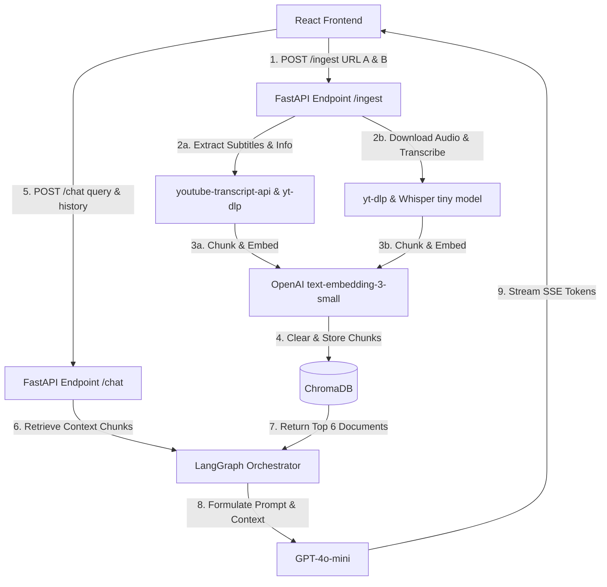

# VideoRAG: Chat & Compare Social Media Videos

A full-stack RAG (Retrieval-Augmented Generation) chatbot application for analyzing and comparing two social media videos side-by-side (YouTube and Instagram Reels). The app fetches transcripts and metrics, indexes them in a local vector database, and lets you ask comparative questions via a streaming conversational AI chat interface with memory.

---

## What It Does

1. **Ingestion & Processing (`POST /ingest`):**
   - Takes a **YouTube URL (Video A)** and an **Instagram Reel URL (Video B)**.
   - For YouTube, extracts metadata via `yt-dlp` and retrieves transcripts via `youtube-transcript-api`.
   - For Instagram Reels, extracts metadata via `yt-dlp`, downloads audio, and transcribes it locally using the Whisper `tiny` model.
   - Computes standard video engagement metrics on the backend: `Engagement Rate = (likes + comments) / views * 100`.
   - Chunks transcripts (500 tokens with 50 tokens overlap) and embeds them with OpenAI `text-embedding-3-small`.
   - Stores embeddings in a SQLite-backed ChromaDB vector collection.

2. **Conversational RAG Chat (`POST /chat`):**
   - Accepts user messages and tracks chat history for context.
   - Runs a LangGraph RAG chain that retrieves the top 6 relevant transcript chunks from both videos.
   - Generates contextual answers using `gpt-4o-mini` with turn-by-turn memory.
   - Streams responses token-by-token using FastAPI Server-Sent Events (SSE).
   - Inlines citation markers (e.g. `[Video A · chunk 2]` and `[Video B · chunk 0]`) which the frontend renders as premium pill badges (`A-chunk 2`).

3. **Premium Frontend UI (React + Vite):**
   - Replicates the charcoal dark dashboard layout exactly.
   - Side-by-side metric cards showing Title, Views, Likes, Comments, Duration, Engagement rate banner, Creator name, and Follower counts.
   - Chat console with SSE streaming text reader, custom badge citation parsers, and quick-reply recommendation buttons.
   - Supports a **Demo Mode** on startup (loads pre-scraped video metrics and mock transcripts instantly to test the UI flow without scraping).

---

## Setup & Running Guide

### Prerequisites
- **Python 3.10+**
- **Node.js 18+ & NPM**
- **FFmpeg** (required by `yt-dlp` and `whisper` to process audio files). Ensure `ffmpeg` is installed and added to your system path.

### Backend Setup
1. Navigate to the backend directory:
   ```bash
   cd backend
   ```
2. Create and configure your environment file:
   ```bash
   # Copy env template
   copy .env.example .env
   # Add your OpenAI API key
   ```
3. Install backend dependencies:
   ```bash
   pip install -r requirements.txt
   ```
4. Start the FastAPI development server:
   ```bash
   python main.py
   ```
   The backend will start running at `http://localhost:8000`.

### Frontend Setup
1. Navigate to the frontend directory:
   ```bash
   cd ../frontend
   ```
2. Install npm packages:
   ```bash
   npm install
   ```
3. Start the Vite development server:
   ```bash
   npm run dev
   ```
   Open `http://localhost:5173` in your browser.

---

## Environment Variables (`.env`)

Create a `.env` in the `/backend` folder with the following variables:

```env
OPENAI_API_KEY=sk-proj-Wvf4KiK_...
PORT=8000
```

---

## Architecture Design



---

## Technology Trade-offs

1. **Why GPT-4o-mini (LLM):**
   - **Cost & Speed:** It is significantly cheaper than GPT-4o while maintaining high reasoning quality for retrieval tasks, summarization, and tabular comparisons. It also has a lower latency which is crucial for streaming chat interfaces.

2. **Why ChromaDB (Vector Database):**
   - **Zero-Config Local Setup:** ChromaDB is a self-contained vector database that runs inside python. It doesn't require any cloud subscription, signup, or local docker engine, making it perfect for rapid prototyping and local deployments.

3. **Why LangGraph (Orchestration):**
   - **Stateful Memory Control:** Unlike simple linear chains, LangGraph allows defining cycles and custom state shapes. This makes it easy to pass conversation history parameters, customize retrieval flows, and ensure deterministic behavior across chat turns.

---

## Scaling to 10,000 Users: What Breaks & How to Fix

If this system is deployed to production and handles 10,000+ active users, several bottlenecks will emerge. Here is what breaks and how we scale it:

### 1. Vector Database Bottleneck (ChromaDB)
* **What Breaks:** ChromaDB running locally stores data in a SQLite file. Concurrent write requests during ingestion will cause lock contention, database corruption, or slow query latency.
* **The Solution:** Migrate to a hosted, distributed vector database like **Qdrant** or **Pinecone**. Qdrant provides isolated collection namespace structures, metadata filters, and handles millions of vectors with sub-millisecond search speeds.

### 2. Transcription Bottleneck (Local Whisper)
* **What Breaks:** Transcribing audio files using Whisper locally on a CPU block requests, consumes high server RAM/CPU, and scales poorly (a single core can only run 1 transcription at a time).
* **The Solution:** Offload audio transcription to an external API service like **AssemblyAI** or **Deepgram**, or host Whisper on an auto-scaling GPU cluster (e.g., RunPod or AWS EC2 g4dn instances) using Whisper APIs.

### 3. Blocking Scrapers (YouTube & Instagram Blocks)
* **What Breaks:** Ingestion scrapes videos on-the-fly. YouTube and Instagram aggressively block requests from cloud providers (AWS, GCP, DigitalOcean) with CAPTCHAs and HTTP 429 rate limit exceptions.
* **The Solution:** Use proxy rotators (e.g. Bright Data, ScrapingBee) or platform API aggregators (e.g. Apify, Social-Scraper API) to bypass scraping blocks and fetch video metadata reliably.

### 4. Monolithic Web Server Bottleneck (FastAPI Synchronous Processing)
* **What Breaks:** Video downloading, audio extraction, and transcription are high-latency tasks. If handled directly inside the HTTP request loop, the server's thread pool will quickly exhaust, causing incoming user chat requests to time out.
* **The Solution:** Implement a task queue using **Celery** or **Arq** with **Redis** as a broker. 
  - The HTTP request starts an asynchronous background job: `POST /ingest` returns a `task_id` instantly.
  - The frontend polls `GET /status/<task_id>` to render status progress bars.
  - Celery workers download, transcribe, and index the video asynchronously.
  - Redis caches scraped metadata for popular videos to prevent redundant scraping.
